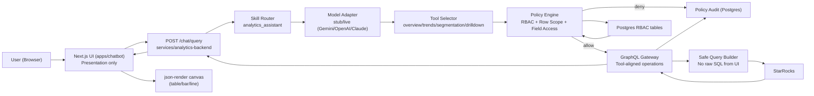

# Chatbot V2 Architecture

## Separation of concerns
- UI: chat UX + render only.
- Backend: skill orchestration, tool routing, policy, GraphQL, data access.
- Postgres: RBAC and policy audit metadata.
- StarRocks: analytics data.

## Security boundary
- UI cannot execute SQL.
- LLM cannot execute SQL directly.
- Only backend query builder executes constrained SQL after policy allow.
